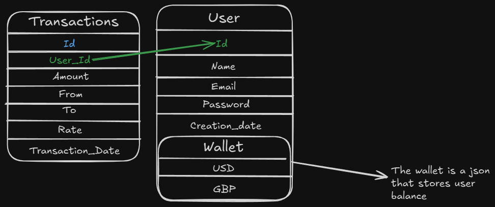

# 💱 Exchange_of_Currencies - Backend
This is the backend service for the Exchange of Currencies platform. It handles user authentication, wallet management, transactions, and real-time currency exchange rates.

## 💽 Installation
First, clone the repository and navigate to the backend folder:
```bash
git clone https://github.com/VitorCesarinoMarchese/Exchange_of_Currencies.git
cd Exchange_of_Currencies/Exchange_Back
```

Install dependencies:
```bash
npm install
```

## 🔑 Environment Variables (.env)
Create a `.env` file in the `Exchange_Back` folder and add the following keys:
```env
API_KEY_WEBSOCKET=Your_API_KEY_WEBSOCKET
API_KEY=Your_API_KEY
URL_WEBSOCKET=wss://marketdata.tradermade.com/feedadv
URL_REST=https://marketdata.tradermade.com/api/v1/
MONGODB=Your_MongoDB_Connection_Key
JWT_REFRESH_SECRET=Your_JWT_REFRESH_SECRET
JWT_SECRET=Your_JWT_SECRET
```
**Note:** Ensure you replace `Your_` values with the correct credentials, or the backend will not function properly.

## 🏃 Running the Backend
To start the backend, run the following command:
```bash
npm run dev
```
The backend will start and be available at `http://localhost:3030`.

## 📜 API Documentation
Once the backend is running, you can access the API documentation via Swagger:
- **Swagger UI:** [http://localhost:3030/api/docs](http://localhost:3030/api/docs)

## 📚 Database Schema
The backend uses MongoDB to store user data, wallets, and transactions.



## 🚀 Technologies Used
- **Node.js** with **Express.js**
- **MongoDB** for database management
- **JWT** for authentication
- **WebSockets** for real-time exchange rates
- **Swagger** for API documentation


