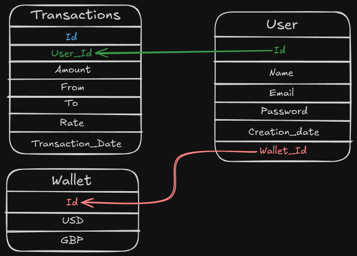

# 💱 Exchange_of_Currencies - Backend

This is the backend service for the Exchange of Currencies platform. It handles user authentication, wallet management, transactions, and real-time currency exchange rates.

## 📦 Installation

First, clone the repository and navigate to the backend folder:

```bash
git clone https://github.com/VitorCesarinoMarchese/Exchange_of_Currencies.git
cd Exchange_of_Currencies/SQL-Exchange_Back
```

### Running with Docker

To run the backend using Docker Compose, follow these steps:

1. **Build and start the backend container**:

   ```bash
   docker-compose up --build
   ```

2. The backend will be available at `http://localhost:3030`.

### Running Locally (without Docker)

To run the backend locally, follow these steps:

1. Install dependencies:

   ```bash
   npm install
   ```

2. Start the backend:

   ```bash
   npm run dev
   ```

3. The backend will be available at `http://localhost:3030`.

## 🔑 Environment Variables (.env)

Create a `.env` file in the `Exchange_Back` folder and add the following keys:

```env
API_KEY_WEBSOCKET=Your_API_KEY_WEBSOCKET
API_KEY=Your_API_KEY
URL_WEBSOCKET=wss://marketdata.tradermade.com/feedadv
URL_REST=https://marketdata.tradermade.com/api/v1/
JWT_REFRESH_SECRET=Your_JWT_REFRESH_SECRET
JWT_SECRET=Your_JWT_SECRET
POSTGRESS_PASSWORD=123456
API_KEY_HUBSPOT=Your_API_KEY_HUBSPOT
URL_HUBSPOT=https://api.hubapi.com/crm/v3/objects
```

**Note:** Ensure you replace `Your_` values with the correct credentials, or the backend will not function properly.

## 📜 API Documentation

Once the backend is running, you can access the API documentation via Swagger:

- **Swagger UI:** [http://localhost:3030/api/docs](http://localhost:3030/api/docs)

## 📚 Database Schema

The backend uses **Postgresql** to store user data, wallets, and transactions.



## 🧑‍💻 HubSpot Integration

The backend integrates with **HubSpot** to manage users and transactions. Here's how it works:

- **Users are stored as contacts in HubSpot**: When a user registers on the platform, their information (such as name, email, etc.) is sent to HubSpot to be stored as a contact. This allows the platform to track users through their HubSpot account.
- **Transactions are stored as deals in HubSpot**: Each transaction made by the user is treated as a **deal** in HubSpot and is assigned to the respective user’s contact. This helps in tracking the user's transaction history directly in HubSpot and managing the user journey.

The API key for HubSpot can be set in the `.env` file (`API_KEY_HUBSPOT`), and the HubSpot API URL is defined as `URL_HUBSPOT`.

## 🔄 Queue System

The backend ensures sequential transaction processing using **Bull** and **Redis**. This prevents concurrent modifications of wallet balances.

## 🚀 Technologies Used

- **Node.js** with **Express.js**
- **PostgreSQL** for database management
- **Bull** for queue processing
- **Redis** for handling job queues
- **JWT** for authentication
- **WebSockets** for real-time exchange rates
- **Swagger** for API documentation
- **HubSpot API** for storing users as contacts and transactions as deals
